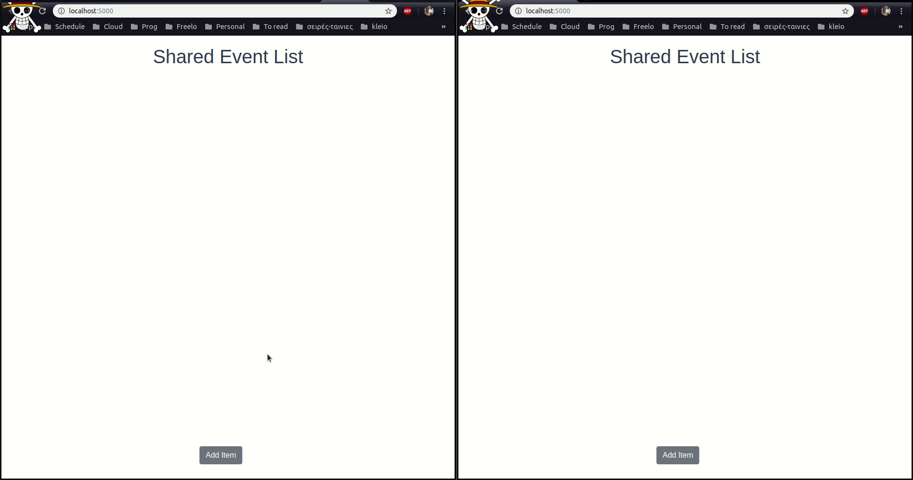

# README  Node.js / Vue Realtime Update

This is a project using Node.js, MongoDB, Vue.js and socket.io for creating an app showing documents saved on MongoDB and have live update on document changes.

## Table of Contents
- [Prerequisites](#prerequisites)
- [Installation](#installation)
- [Demonstration](#Demonstration)
- [Issues and Questions](#issues)

## Prerequisites
Things needed to be installed before running the app.
- [MongoDb](https://www.mongodb.com/)
-  [Node](https://nodejs.org/en/)
-  [Vue CLI](https://cli.vuejs.org/)

## Installation

First clone the project. Go to a terminal and type:
```
git clone https://github.com/KabitakisGiorgos/vue-node-app.git
```
Get into the server folder inside the project and install dependencies
```
cd vue-node-app/server
npm i
```

Open MongoDB service and start the server
```
npm init
```
The **npm init** command is only needed on the first time in order to build the vue project. Later you can use 
```
npm start
```

just to start the server and serve the vue page.

After finishing all the installations a page will pop up at your browser.If not use the url [http://localhost:5000/](localhost:5000) on your browser.

## Demonstration

## Issues

For any issues or any questions about the implemantation feel free to contact with me
George Kabitakis ```gkabitakis@gmail.com ``` or [open an issue](https://github.com/KabitakisGiorgos/vue-node-app/issues/new)
